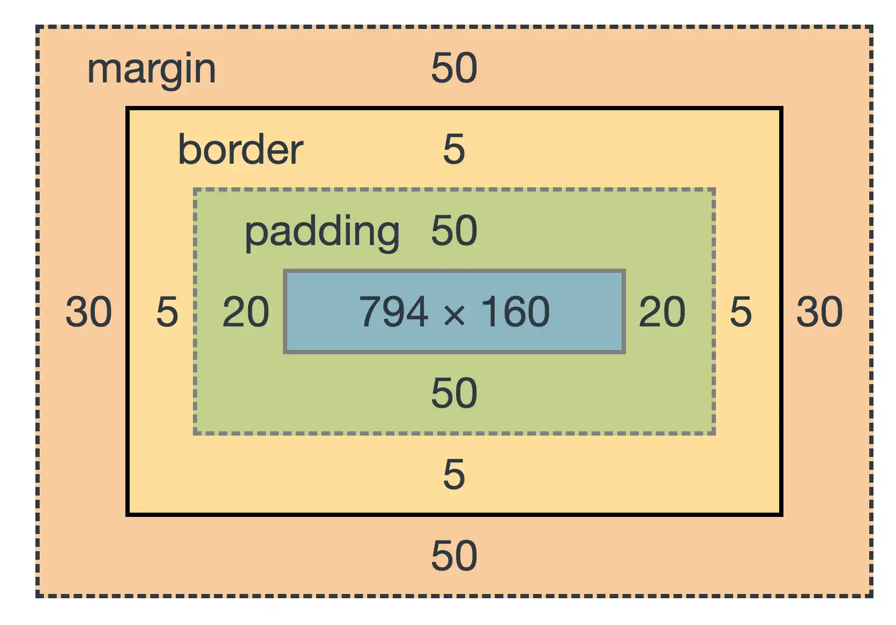
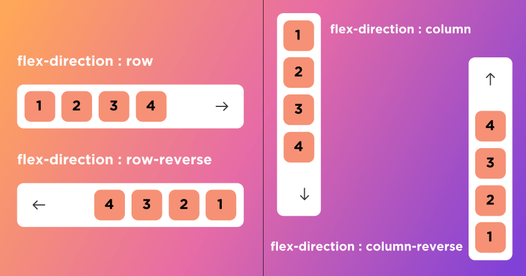
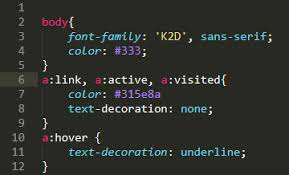

# CSS

É uma linguagem em modo cascata é usado para decorar sites e páginas web. 

```
button {
  background-color: #4CAF50; /* Verde */
  color: white;
  padding: 10px 20px;
  border: none;
  border-radius: 5px;
  cursor: pointer;
}

button:hover {
  background-color: #45a049; /* Verde escuro quando o botão é focado */
}

```
Css pode ser colocado na mesmo página do HML dentro de uma tag ```<style></style>```

Por Exemplo:

```<tile style="color: blue;">Hello World </title>```
<tile style="color: blue;">Hello World </title>

<h4>Box Models</h4>



<h4>Flex Box</h4>



<h4>Pseudo-Classe</h4>

